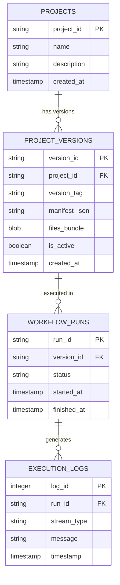

# Architecture Specifications — PolyOrch

## 1. System Overview

PolyOrch employs a **Supervisord-Monitored Single-Container Architecture**. It encapsulates four distinct architectural layers within a single Alpine-based Docker container:

1. **Process Management Layer (`Supervisord`):** Init system (PID 1) monitoring daemon processes.
2. **Control & Presentation Layer (`Go API + React`):** REST API, WebSocket server, and static frontend host.
3. **Event Broker & Queue Layer (`NATS JetStream`):** Low-latency messaging system running in-memory with disk fallback.
4. **Execution Engine Layer (`Go Worker + Subprocess`):** Task fetcher, ZIP payload expander, and OS process runner.

---

## 2. Process Lifecycle & Supervisord Specification

Supervisord runs as System PID 1 inside the Docker container. It monitors standard output streams, manages log rotations, and controls process restarts:

```ini
[supervisord]
nodaemon=true
logfile=/var/log/supervisord.log
pidfile=/var/run/supervisord.pid

[program:nats-server]
command=/usr/local/bin/nats-server -js -sd /data/nats
autostart=true
autorestart=true
stdout_logfile=/dev/stdout
stdout_logfile_maxbytes=0
stderr_logfile=/dev/stderr
stderr_logfile_maxbytes=0

[program:polyorch-api]
command=/app/polyorch-api
environment=PORT="8080",DB_PATH="/data/polyorch.db?_journal_mode=WAL",NATS_URL="nats://127.0.0.1:4222"
autostart=true
autorestart=true
stdout_logfile=/dev/stdout
stdout_logfile_maxbytes=0
stderr_logfile=/dev/stderr
stderr_logfile_maxbytes=0

[program:polyorch-worker]
command=/app/polyorch-worker
environment=DB_PATH="/data/polyorch.db?_journal_mode=WAL",NATS_URL="nats://127.0.0.1:4222",RUNS_TMP_DIR="/tmp/runs"
autostart=true
autorestart=true
stdout_logfile=/dev/stdout
stdout_logfile_maxbytes=0
stderr_logfile=/dev/stderr
stderr_logfile_maxbytes=0
```

---

## 3. Storage & Database Schema Design

PolyOrch utilizes SQLite in **Write-Ahead Logging (WAL) Mode** (`/data/polyorch.db`), enabling high-concurrency non-blocking reads while writing run statuses and code BLOBs.



---

## 4. Subprocess Isolation Strategy

When executing tasks:
1. Worker acquires task event payload containing `run_id` and `version_id`.
2. SQLite query fetches the `.zip` archive BLOB for the matching `version_id`.
3. Worker creates `/tmp/runs/{run_id}/` workspace directory.
4. Archive expands into workspace.
5. Worker runs `os/exec.Command(runtime, entrypoint)` with custom environment variables injected from `manifest.json`.
6. Standard Output (`stdout`) and Standard Error (`stderr`) pipes bind to NATS Publishers line-by-line.
7. Workspace path `/tmp/runs/{run_id}/` is removed via `defer os.RemoveAll(...)`.
