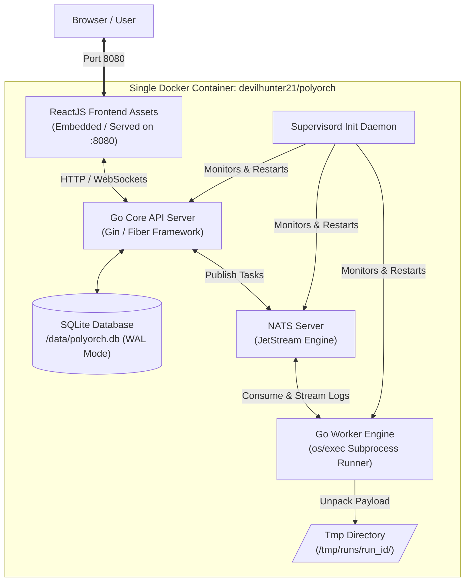
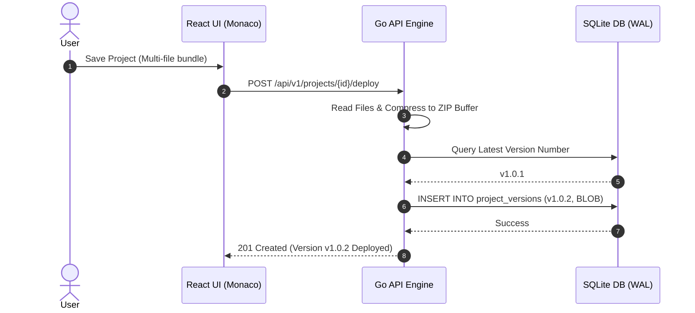

# Flow Diagrams — PolyOrch

## 1. System Architecture Flow Diagram

The diagram below illustrates component interactions inside the single Docker container:



---

## 2. Project Versioning & Deployment Sequence Flow



---

## 3. Workflow Execution & Real-Time Log Streaming Flow

```mermaid
sequenceDiagram
    autonumber
    actor User
    participant UI as React UI (xterm.js)
    participant API as Go API Engine
    participant NATS as NATS JetStream
    participant Worker as Go Worker Engine
    participant DB as SQLite DB
    participant Proc as Script Subprocess (Python/Node)

    User->>UI: Click "Run Workflow"
    UI->>API: POST /api/v1/workflows/{id}/run
    API->>NATS: Publish to "tasks.execute" (run_id: 8921)
    API-->>UI: 202 Accepted (run_id: 8921)
    
    UI->>API: Connect WebSocket /ws/logs/8921
    API->>NATS: Subscribe to "logs.8921"
    
    NATS-->>Worker: Deliver Task Payload (run_id: 8921)
    Worker->>DB: Fetch ZIP BLOB for Version
    DB-->>Worker: Return Binary Archive BLOB
    Worker->>Worker: Unpack ZIP to /tmp/runs/run_8921/
    
    Worker->>Proc: Exec: python3 main.py
    
    loop Real-Time Log Streaming
        Proc-->>Worker: Standard I/O output line
        Worker->>NATS: Publish to "logs.8921"
        NATS-->>API: Stream Event
        API-->>UI: Send WebSocket Frame
        UI->>UI: Render in xterm.js terminal
    end

    Proc-->>Worker: Exit Code 0
    Worker->>DB: UPDATE workflow_runs SET status='SUCCESS'
    Worker->>Worker: Remove /tmp/runs/run_8921/
