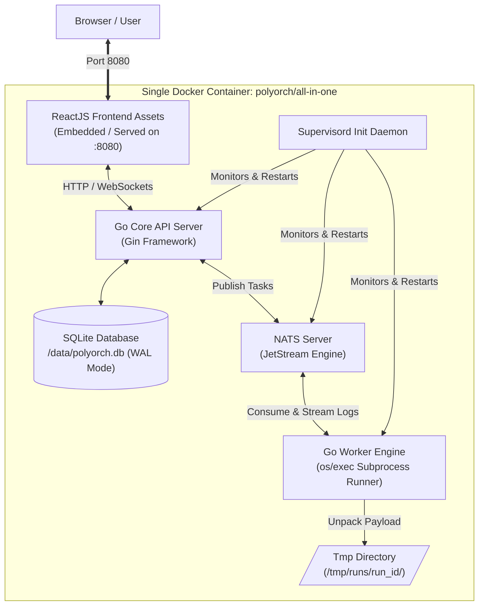

# PolyOrch — Lightweight Polyglot DAG Orchestrator


A lightweight, production-ready polyglot DAG orchestrator built with Go, NATS JetStream, and SQLite. Runs multi-language workloads (Python, Node.js, Bash) inside a single Docker container with real-time log streaming, Monaco IDE, and React Flow visualization.

**Live Demo:** [https://nimish-nirmal.github.io/polyorch/](https://nimish-nirmal.github.io/polyorch/)

## ✨ Features

### Core Features
- 🐳 **Single Container** — All components (API, worker, NATS, DB, UI) in one Alpine image
- 🚀 **Sub-2s Boot** — Cold start in under 2 seconds
- 💾 **Zero External DB** — SQLite WAL mode for ACID persistence
- 📡 **Real-Time Logs** — WebSocket streaming via NATS Pub/Sub with xterm.js
- 📜 **Immutable Versioning** — ZIP snapshots stored as SQLite BLOBs with instant rollback
- 🌐 **Web IDE** — Monaco Editor + React Flow DAG + live terminal
- 🔒 **ASH Security** — Automated security scanning (Trivy, gosec, TruffleHog)

### Runtime Support
- **Python 3** — `python3 main.py`
- **Node.js** — `node main.js`
- **Bash** — `bash script.sh`
- **Go Binaries** — Execute compiled tools

## 🚀 Quick Start

### Option 1: Docker (Recommended)
```bash
git clone https://github.com/nimish-nirmal/polyorch.git
cd polyorch
docker compose up -d
curl http://localhost:8080/health
```

### Option 2: Local Development
```bash
git clone https://github.com/nimish-nirmal/polyorch.git
cd polyorch

# Install dependencies
make deps

# Start NATS (separate terminal)
nats-server -js -sd /tmp/nats

# Build and run
make run
```

## 🔐 Authentication

PolyOrch includes built-in authentication with JWT tokens.

### Default Credentials
- **Username:** `admin`
- **Password:** `password`

You will be prompted to change the default password on first login.

### Environment Variables
| Variable | Description | Default |
| :--- | :--- | :--- |
| `POLYORCH_AUTH_BYPASS` | Skip authentication (local dev only) | `false` |
| `POLYORCH_API_KEY` | Legacy API key (deprecated) | `""` |

**Local Development Bypass:**
```bash
POLYORCH_AUTH_BYPASS=true make run
```

**Note:** `POLYORCH_AUTH_BYPASS` is intended for local development only. Do NOT use it in production or on GitHub Pages.

### Password Management
- **Change Password:** Use the "Change Password" button in the sidebar
- **Reset Password:** POST `/api/v1/auth/reset` with a new password (requires authentication)

## 📦 Project Structure

```
polyorch/
├── cmd/
│   ├── api/              # Go API server (Gin)
│   │   └── main.go
│   └── worker/           # Go Worker engine
│       └── main.go
├── internal/
│   ├── config/           # Viper configuration
│   ├── database/         # SQLite + migrations
│   ├── handlers/         # REST API handlers
│   ├── middleware/       # CORS, auth, security headers
│   ├── models/           # Data models and DTOs
│   ├── nats/             # NATS JetStream client
│   ├── websocket/        # WebSocket hub + handler
│   └── worker/           # Task execution engine
├── web/                  # React frontend (Vite + TS + Tailwind)
│   ├── src/
│   │   ├── components/   # Monaco, Terminal, DAG, CodeEditor
│   │   ├── pages/        # Dashboard, Projects, Runs
│   │   ├── hooks/        # useProjects, useRuns, useWebSocket
│   │   └── services/     # Axios API client
│   ├── package.json
│   └── vite.config.ts
├── scripts/
│   ├── entrypoint.sh     # Docker entrypoint
│   └── supervisord.conf  # Process manager config
├── Dockerfile            # Multi-stage production build
├── docker-compose.yml    # Local deployment
├── Makefile              # Build automation
└── .github/
    └── workflows/
        ├── security.yml        # ASH scanning
        ├── docker-publish.yml  # Docker Hub
        └── deploy-frontend.yml # GitHub Pages
```

## 🛠️ Technologies Used

| Technology | Version | Purpose |
|-----------|---------|---------|
| **Go** | 1.22 | API server + Worker engine |
| **Gin** | v1.10.0 | HTTP framework |
| **NATS JetStream** | v1.35.0 | Task queue + log streaming |
| **SQLite** | v1.14.22 | WAL-mode persistence |
| **React** | 18.2.0 | Frontend UI |
| **Tailwind CSS** | 3.3.0 | Styling |
| **Monaco Editor** | 4.6.0 | Code editing |
| **React Flow** | 11.10.0 | DAG visualization |
| **xterm.js** | 5.3.0 | Terminal emulator |
| **Supervisord** | 4.2.5 | Process management |
| **Alpine Linux** | 3.19 | Container base image |

## 🚢 Deployment

### GitHub Pages (Automatic)
Push changes to `web/` on `main` branch to auto-deploy frontend:
- **Live Demo:** https://nimish-nirmal.github.io/polyorch/

### Docker Hub (Automatic)
Push to `main` or tag `v*` to build and push:
```bash
docker pull polyorch/all-in-one:latest
docker run -d -p 8080:8080 -v polyorch_data:/data polyorch/all-in-one:latest
```

### Local Docker
```bash
docker compose up -d
```

## 🔒 Security

PolyOrch includes **Automatic Security Hardening (ASH)**:
- **Trivy** — Container and filesystem vulnerability scanning
- **gosec** — Go SAST for security flaws
- **TruffleHog** — Secret scanning
- **Docker Bench** — CIS Docker Benchmark

See [SECURITY.md](SECURITY.md) for details.

## 📚 Documentation

| Document | Description |
| :--- | :--- |
| **[QUICKSTART.md](QUICKSTART.md)** | Setup guide for local and Docker |
| **[DEMO.md](DEMO.md)** | Full demo walkthrough with sample projects |
| **[PRD.md](PRD.md)** | Product requirements |
| **[ARCHITECTURE.md](ARCHITECTURE.md)** | System architecture |
| **[FLOWDIAGRAM.md](FLOWDIAGRAM.md)** | Mermaid diagrams |
| **[PLAN.md](PLAN.md)** | Development roadmap |
| **[SECURITY.md](SECURITY.md)** | Security policy and ASH checklist |

## 🤝 Contributing

1. Fork the repository
2. Create a feature branch
3. Make changes and ensure `make fmt` passes
4. Commit and push
5. Open a Pull Request

## 📄 License

Distributed under the **MIT License**. See `LICENSE` for details.

## 📞 Support

- **Issues:** [GitHub Issues](https://github.com/nimish-nirmal/polyorch/issues)
- **Repository:** [https://github.com/nimish-nirmal/polyorch](https://github.com/nimish-nirmal/polyorch)

---

**Built with ❤️ using Go, NATS JetStream, SQLite, and React**

**Your Name:** Nimish Nirmal  
**Repository:** [https://github.com/nimish-nirmal/polyorch](https://github.com/nimish-nirmal/polyorch)

---

## 📑 Table of Contents

- [🌟 Why PolyOrch?](#-why-polyorch)
- [⚡ Key Features](#-key-features)
- [🏗️ Architecture Overview](#️-architecture-overview)
- [🛠️ Tech Stack](#️-tech-stack)
- [📁 Project Structure](#-project-structure)
- [🚀 Quick Start](#-quick-start)
  - [Option 1: Docker (Recommended)](#option-1-docker-recommended)
  - [Option 2: Local Development](#option-2-local-development)
- [🎬 Demo & Showcase](#-demo--showcase)
- [📚 Documentation](#-documentation)
- [🧪 Testing](#-testing)
- [🤝 Contributing](#-contributing)
- [📄 License](#-license)

---

## 🌟 Why PolyOrch?

Modern data teams need orchestration tools that are **fast**, **portable**, and **easy to operate**. Apache Airflow, Prefect, and Dagster are powerful but come with heavy operational overhead: multiple containers, external databases, complex Kubernetes deployments, and slow startup times.

**PolyOrch solves this** by embedding everything into a single Alpine-based Docker image:

| Problem | PolyOrch Solution |
| :--- | :--- |
| Multi-container complexity | **Single container** managed by Supervisord |
| Slow cold starts | **Sub-2 second** boot time |
| High RAM usage | **< 40 MB** idle overhead |
| External database required | **SQLite WAL** embedded, zero external DB |
| Complex log aggregation | **Real-time WebSocket streaming** via NATS Pub/Sub |
| Version control for code | **Immutable ZIP snapshots** stored as SQLite BLOBs |
| Multi-language support | **Python 3, Node.js, Bash, Go binaries** out of the box |

---

## ⚡ Key Features

<!-- Each feature is documented with implementation details in ARCHITECTURE.md -->

### 🐳 All-in-One Single Container
Zero multi-container complexity. Supervisord manages NATS, the Go Control Plane, Worker execution loops, and static Web UI serving within a **single container image**. No Docker Compose required for production.

### 🚀 Polyglot Subprocess Execution
Run multi-file project packages in isolated runtime directories:
- **Python 3** — `python3 main.py`
- **Node.js** — `node main.js`
- **Bash** — `bash script.sh`
- **Go binaries** — execute compiled Go tools

Custom imports, helper modules, and config files are fully supported.

### ⚡ High-Throughput, Low Footprint
Starts up in under **2 seconds** and operates under **40 MB RAM** overhead by leveraging Go goroutines and NATS JetStream for event-driven architecture.

### 📜 Immutable Code Versioning
Every project deployment creates a compressed `.zip` version snapshot stored directly in SQLite as a BLOB. Inspect, execute, or rollback to historical versions (`v1.0.0`, `v1.0.1`) instantly.

### 📡 Real-Time Log Streaming
Live `stdout`/`stderr` terminal log streaming over **WebSockets** powered by NATS Pub/Sub and rendered with **xterm.js**. Sub-100ms latency from worker to browser.

### 💻 Modern Web IDE
Built-in React dashboard featuring:
- **Multi-tab code editing** (`@monaco-editor/react`) with syntax highlighting
- **Visual DAG execution graphs** (`React Flow`) with live status colors
- **Execution controls** — run, stop, rollback versions
- **Real-time terminal** attached directly to execution handles

### 💾 Zero-External-Dependency Persistence
SQLite configured in **Write-Ahead Logging (WAL)** mode provides ACID-compliant persistence without requiring a standalone database server.

---

## 🏗️ Architecture Overview

<!-- Detailed architecture: see ARCHITECTURE.md -->

Everything runs isolated inside one Docker container managed by Supervisord:



**Architecture layers:**
1. **Process Management Layer** — Supervisord (PID 1) monitors and auto-restarts crashed processes
2. **Control & Presentation Layer** — Go API (Gin) + React frontend served on `:8080`
3. **Event Broker Layer** — NATS JetStream on `:4222` for task queues and log streaming
4. **Execution Engine Layer** — Go Worker consumes tasks, unpacks ZIPs, runs subprocesses

---

## 🛠️ Tech Stack

<!-- Full stack details with version pins: see go.mod and web/package.json -->

| Component | Technology | Version | Purpose |
| :--- | :--- | :--- | :--- |
| **Container Init** | `Supervisord` | Latest | Process manager overseeing NATS, Go API, & Workers |
| **Control Plane API** | `Go` + `Gin` | 1.22 / v1.10.0 | REST API, WebSocket handler, static asset server |
| **Event Messaging** | `NATS JetStream` | v1.35.0 | Persistent task queue and log distribution |
| **Persistence** | `SQLite` (WAL Mode) | v1.14.22 | Workflow metadata, runs, and code snapshots |
| **Task Runner** | `Go Worker` | 1.22 | Consumes NATS events, extracts ZIPs, executes code |
| **Runtimes** | `Python 3`, `Node.js` | Alpine packages | Pre-installed interpreters for polyglot execution |
| **Frontend UI** | `React` + `Tailwind` | 18.2.0 / 3.3.0 | Monaco Editor, React Flow DAG viewer, xterm.js terminal |
| **WebSocket** | `gorilla/websocket` | v1.5.1 | Real-time log streaming to browser |
| **Logging** | `zerolog` | v1.33.0 | Structured JSON logging |
| **Config** | `viper` | v1.19.0 | Environment-based configuration |

**Frontend dependencies (exact versions in `web/package-lock.json`):**
- React 18.2.0, React Router 6.20.0
- @monaco-editor/react 4.6.0
- React Flow 11.10.0
- xterm 5.3.0 + xterm-addon-fit 0.8.0
- Axios 1.6.0, Zustand 4.4.0

---

## 📁 Project Structure

```text
polyorch/
├── cmd/                          # Application entrypoints
│   ├── api/                      #   Go API server (Gin)
│   │   └── main.go
│   └── worker/                   #   Go Worker engine
│       └── main.go
├── internal/                     # Private application code
│   ├── config/                   #   Viper-based configuration loader
│   ├── database/                 #   SQLite setup, migrations, store
│   │   └── migrations/
│   │       └── 001_initial_schema.up.sql
│   ├── handlers/                 #   HTTP handlers (projects, workflows, health)
│   ├── middleware/               #   CORS, auth, request logging
│   ├── models/                   #   Data models and DTOs
│   ├── nats/                     #   NATS client, JetStream setup, task publishing
│   ├── websocket/                #   WebSocket hub and handler
│   └── worker/                   #   Worker engine, subprocess executor
├── web/                          # React frontend (Vite + TypeScript + Tailwind)
│   ├── src/
│   │   ├── components/           #   Reusable UI components
│   │   ├── pages/                #   Route pages
│   │   ├── hooks/                #   Custom React hooks
│   │   ├── services/             #   API client
│   │   └── utils/                #   Helpers
│   ├── package.json              #   Exact versions locked
│   ├── package-lock.json         #   npm lockfile
│   ├── vite.config.ts            #   Vite config (GitHub Pages base path)
│   └── tailwind.config.js        #   Tailwind CSS config
├── scripts/                      # Build and deployment scripts
│   ├── entrypoint.sh             #   Docker entrypoint with signal handling
│   └── supervisord.conf          #   Supervisord process config
├── docs/                         # Additional documentation
├── .github/workflows/            # CI/CD pipelines
│   ├── deploy-frontend.yml       #   GitHub Pages deployment
│   └── docker-publish.yml        #   Docker Hub publish
├── Dockerfile                    # Multi-stage production build
├── docker-compose.yml            # Local Docker Compose
├── Makefile                      # Build automation
├── go.mod                        # Go module definition (pinned versions)
├── go.sum                        # Go dependency checksums
├── vendor/                       # Vendored Go dependencies (offline-ready)
│   └── modules.txt
├── .env.example                  # Environment template
├── web/.env.example              # Frontend environment template
├── README.md                     # This file
├── QUICKSTART.md                 # Step-by-step setup guide
├── DEMO.md                       # Demo and showcase guide
├── PRD.md                        # Product Requirements Document
├── ARCHITECTURE.md               # Architecture Specifications
├── FLOWDIAGRAM.md                # System flow diagrams
├── PLAN.md                       # Development roadmap
└── LICENSE                       # MIT License
```

---

## 🚀 Quick Start

### Option 1: Docker (Recommended)

<!-- Fastest way to run PolyOrch in production -->

**Prerequisites:** Docker Engine 20.10+, Docker Compose v2+

```bash
# 1. Clone the repository
git clone https://github.com/nimish-nirmal/polyorch.git
cd polyorch

# 2. Start with Docker Compose
docker compose up -d

# 3. Verify it's running
curl http://localhost:8080/health
# Expected: {"status":"ok"}
```

**Access points:**
- 🌐 **Web UI Dashboard:** `http://localhost:8080`
- 🌍 **Live Demo (GitHub Pages):** https://nimish-nirmal.github.io/polyorch/
- 📖 **Swagger API Docs:** `http://localhost:8080/swagger/index.html`
- 💚 **Health Check:** `http://localhost:8080/health`
- 📡 **NATS Monitoring:** `nats://localhost:4222` (use `nats-server -js` separately if needed)

**Stop the stack:**
```bash
docker compose down
# Data persists in Docker volume 'polyorch_data'
```

### Option 2: Local Development

<!-- For developers who want to run services directly -->

**Prerequisites:** Go 1.22+, Node.js 20+, npm 9+, SQLite3, NATS Server

```bash
# 1. Clone and enter
git clone https://github.com/nimish-nirmal/polyorch.git
cd polyorch

# 2. Install Go and npm dependencies
make deps

# 3. (Optional) Vendor Go dependencies for offline builds
make vendor

# 4. Start NATS JetStream server (in a separate terminal)
nats-server -js -sd /tmp/nats

# 5. Build and run all services
make run
```

**Or run services individually:**
```bash
# Terminal 1: API server
make build-api
PORT=8080 DB_PATH=/tmp/polyorch.db NATS_URL=nats://127.0.0.1:4222 ./bin/polyorch-api

# Terminal 2: Worker
make build-worker
DB_PATH=/tmp/polyorch.db NATS_URL=nats://127.0.0.1:4222 RUNS_TMP_DIR=/tmp/runs ./bin/polyorch-worker
```

**Frontend development mode:**
```bash
cd web
npm run dev
# Vite dev server at http://localhost:5173 (proxied to :8080)
```

### Option 3: Build Docker Image Locally

<!-- For custom builds and offline environments -->

```bash
# Build the all-in-one image
make docker-build

# Run it
docker run -d \
  --name polyorch \
  -p 8080:8080 \
  -p 4222:4222 \
  -v polyorch_data:/data \
  polyorch/all-in-one:latest

# Check logs
docker logs -f polyorch
```

---

## 🎬 Demo & Showcase

<!-- See DEMO.md for full walkthrough with sample projects -->

### What to Expect

When you open `http://localhost:8080`, you'll see the **PolyOrch Dashboard**:

1. **Dashboard** — Overview cards showing total projects, active runs, success rate, and queue depth. Recent runs table with status badges.
2. **Projects** — Create a new project, upload multi-file code bundles (ZIP + manifest), view version history, and activate/rollback versions.
3. **Runs** — List all workflow runs, filter by status, click into details to see real-time logs and DAG visualization.
4. **Run Detail** — Live xterm.js terminal streaming stdout/stderr from the worker, React Flow DAG showing task nodes with color-coded status.

### Sample Demo Project

A demo project is included in `docs/sample-project/`:

```text
sample-etl/
├── manifest.json       # Runtime: python3, entrypoint: main.py
├── main.py             # Reads config.json, prints "ETL Pipeline Started"
├── helpers/
│   └── transformer.py  # Helper module imported by main.py
└── config.json         # Sample configuration
```

**To run the demo:**
1. Zip the `sample-etl/` folder
2. Go to **Projects** → **New Project**
3. Upload the ZIP and manifest
4. Click **Run** on the active version
5. Watch the terminal stream logs in real-time

### Live Demo Checklist

| Step | Action | Expected Result |
| :--- | :--- | :--- |
| 1 | Open `http://localhost:8080` | Dashboard loads with dark theme |
| 2 | Navigate to **Projects** → **New Project** | Form with name, description, ZIP upload |
| 3 | Upload `sample-etl.zip` + `manifest.json` | Project created, version `v1.0.0` active |
| 4 | Click **Run** on version | Run created, status → `running` |
| 5 | Open Run Detail | xterm.js terminal shows live logs |
| 6 | Wait for completion | Status → `success`, terminal shows exit code 0 |
| 7 | Upload new version | Version `v1.0.1` created |
| 8 | Rollback to `v1.0.0` | Active version switches, run uses old code |

---

## 🔒 Security & ASH

<!-- See [SECURITY.md](SECURITY.md) for the full security policy and ASH checklist -->

PolyOrch includes **Automatic Security Hardening (ASH)** — a CI pipeline that runs on every commit:

- **Trivy** — Container and filesystem vulnerability scanning
- **gosec** — Go SAST for common security flaws
- **TruffleHog** — Secret scanning to prevent credential leaks
- **Docker Bench** — CIS Docker Benchmark compliance
- **npm audit** — Frontend dependency vulnerability scanning

### Production Hardening

| Feature | Status |
| :--- | :--- |
| Non-root container user | ✅ Enabled |
| Read-only filesystem | ✅ Enabled |
| Capability dropping (`cap_drop: ALL`) | ✅ Enabled |
| `no-new-privileges` | ✅ Enabled |
| Security headers (CSP, X-Frame-Options, etc.) | ✅ Enabled |
| API key authentication | ✅ Configurable |
| CORS origin allowlist | ✅ Enabled |
| WebSocket origin validation | ✅ Enabled |
| Request size limits (50MB) | ✅ Enabled |

### Reporting Vulnerabilities

Please report security issues to **security@nimish-nirmal.github.io** — do NOT open public issues.

---

## 📚 Documentation

| Document | Description |
| :--- | :--- |
| **[QUICKSTART.md](QUICKSTART.md)** | Step-by-step setup for local and Docker environments, troubleshooting |
| **[DEMO.md](DEMO.md)** | Full demo walkthrough with sample projects and screenshots |
| **[PRD.md](PRD.md)** | Product Requirements Document — goals, functional & non-functional requirements |
| **[ARCHITECTURE.md](ARCHITECTURE.md)** | Detailed architecture — Supervisord spec, DB schema, subprocess isolation |
| **[FLOWDIAGRAM.md](FLOWDIAGRAM.md)** | Mermaid diagrams — system flow, versioning sequence, execution flow |
| **[PLAN.md](PLAN.md)** | Development roadmap and phase plan |
| **[SECURITY.md](SECURITY.md)** | Security policy, ASH checklist, and vulnerability reporting |
| **[reports/](reports/)** | Security and completeness review reports with before/after fixes |

---

## 🧪 Testing

<!-- Test coverage is being expanded. Currently manual smoke tests are performed. -->

```bash
# Run Go tests (when available)
make test

# Lint Go code
make lint

# Format Go code
make fmt

# Build everything
make build
```

**Manual smoke tests:**
1. Start container: `docker compose up -d`
2. Health check: `curl http://localhost:8080/health`
3. Create project via API or UI
4. Upload version (ZIP + manifest)
5. Trigger run
6. Verify WebSocket logs stream
7. Verify `/tmp/runs/{run_id}` cleanup after completion

---

## 🤝 Contributing

We welcome contributions! Please follow these steps:

1. Fork the repository
2. Create a feature branch: `git checkout -b feature/amazing-feature`
3. Make changes and ensure `make fmt` and `make lint` pass
4. Commit: `git commit -m 'Add amazing feature'`
5. Push: `git push origin feature/amazing-feature`
6. Open a Pull Request

**Code of Conduct:** Be respectful. Constructive feedback only.

---

## 📄 License

Distributed under the **MIT License**. See `LICENSE` for more information.

---

## 🔗 Related Links

- **GitHub Repository:** https://github.com/nimish-nirmal/polyorch
- **Docker Hub Image:** `polyorch/all-in-one:latest` (auto-published on main branch push)
- **Issues & Bugs:** https://github.com/nimish-nirmal/polyorch/issues
- **Releases:** https://github.com/nimish-nirmal/polyorch/releases

---

<p align="center">
  Built with ❤️ using Go, NATS JetStream, SQLite, and React
</p>

<p align="center">
  <a href="https://github.com/nimish-nirmal/polyorch">⭐ Star us on GitHub</a> if you find this project useful!
</p>
