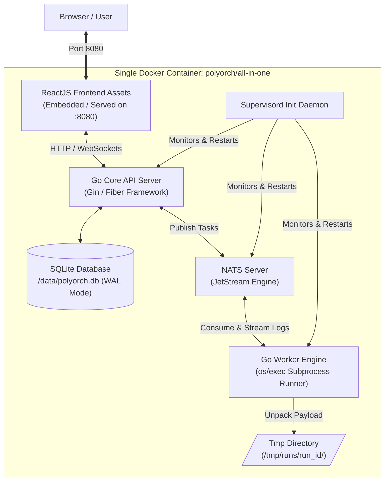

# PolyOrch — Polyglot Micro-Orchestrator Engine

> An ultra-fast, lightweight, self-contained task and DAG orchestration engine designed as a modern, low-footprint alternative to heavy platforms like Apache Airflow.

PolyOrch packages its entire production stack — **NATS JetStream**, **Go Core API & Worker Engine**, **SQLite (WAL Mode)**, **Node.js/Python Runtimes**, and a **ReactJS Frontend** — into a **single, portable Docker container** managed internally by **Supervisord**.

---

## 🌟 Key Capabilities

* **🐳 All-in-One Single Container:** Zero multi-container complexity. Supervisord manages NATS, the Go Control Plane, Worker execution loops, and static Web UI serving within a single container image.
* **🚀 Polyglot Subprocess Execution:** Run multi-file project packages (Python 3, Node.js, Go binaries, Bash) in isolated runtime directories with native module imports.
* **⚡ High-Throughput, Low Footprint:** Starts up in under **2 seconds** and operates under **40 MB RAM** overhead by leveraging Go goroutines and NATS JetStream.
* **📜 Immutable Code Versioning:** Every project deployment creates a compressed `.zip` version snapshot stored directly in SQLite as a BLOB. Inspect, execute, or rollback to historical versions (`v1.0.0`, `v1.0.1`) instantly.
* **📡 Real-Time Log Streaming:** Live `stdout`/`stderr` terminal log streaming over WebSockets powered by NATS Pub/Sub and rendered with `xterm.js`.
* **💻 Modern Web IDE:** Built-in React dashboard featuring multi-tab code editing (`@monaco-editor/react`), visual DAG execution graphs (`React Flow`), and execution controls.
* **💾 Zero-External-Dependency Persistence:** SQLite configured in Write-Ahead Logging (`WAL`) mode provides ACID-compliant persistence without requiring a standalone database server.

---

## 🏗️ Single-Container Architecture Overview

Everything runs isolated inside one Docker container managed by Supervisord:



---

## 🛠️ Stack & Internal Services Overview

| Component | Technology | Internal Port / Location | Purpose |
| :--- | :--- | :--- | :--- |
| **Container Init** | `Supervisord` | System PID 1 | Process manager overseeing NATS, Go API, & Workers in standard I/O |
| **Control Plane API** | `Go` (`Gin` / `Fiber`) | `127.0.0.1:8080` | REST API, WebSocket handler, static asset server, DAG dependency resolver |
| **Event Messaging** | `NATS JetStream` | `127.0.0.1:4222` | Persistent task queue (`WORKFLOW_TASKS`) and log distribution |
| **Persistence** | `SQLite` | `/data/polyorch.db` | High-throughput WAL mode DB for workflow metadata, runs, and code snapshots |
| **Task Runner** | `Go Worker` | Internal Loop | Consumes NATS events, extracts project ZIPs to `/tmp/runs/{id}`, executes code |
| **Runtimes** | `Python 3`, `Node.js` | Container `/usr/bin` | Pre-installed interpreters for multi-language execution |
| **Frontend UI** | `React` + `Tailwind` | Embedded in Go API | Monaco Code Editor, React Flow DAG viewer, xterm.js terminal |

---

## 📁 Multi-File Project Structure

PolyOrch treats projects as self-contained code packages. You can build multi-file Python or Node projects with custom imports and config files.

```text
my_etl_pipeline/
├── manifest.json       # Execution rules, runtime type, & environment variables
├── main.py            # Primary execution entrypoint
├── helpers/
│   ├── db_connector.py # Imported helper module
│   └── parser.py
└── config.json        # Static config read by main.py
```

---

## 📚 Detailed Documentation

For full structural details, see the dedicated documentation files:
* [Project Requirements Document (PRD.md)](./PRD.md)
* [Architecture Specifications (ARCHITECTURE.md)](./ARCHITECTURE.md)
* [System Flow Diagrams (FLOWDIAGRAM.md)](./FLOWDIAGRAM.md)

---

## ⚡ Deployment & Getting Started

<details>
<summary><b>Click to expand Docker CLI & Docker Compose commands</b></summary>

### Option 1: Docker CLI (Fastest)

```bash
docker run -d \
  --name polyorch \
  -p 8080:8080 \
  -v polyorch_data:/data \
  polyorch/all-in-one:latest
```

### Option 2: Docker Compose

```yaml
version: '3.8'

services:
  polyorch:
    image: polyorch/all-in-one:latest
    container_name: polyorch
    ports:
      - "8080:8080"
    volumes:
      - polyorch_data:/data
    restart: unless-stopped

volumes:
  polyorch_data:
```

Once running, access the services in your browser:
* **Web UI Dashboard:** `http://localhost:8080`
* **Swagger API Docs:** `http://localhost:8080/swagger/index.html`
* **Health Check API:** `http://localhost:8080/health`

</details>

---

## 📄 License

Distributed under the MIT License. See `LICENSE` for more information.
